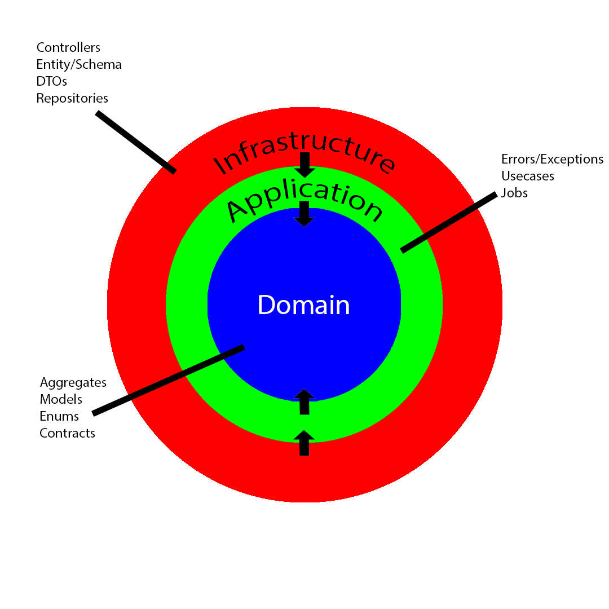

# QuickCash API

- API application made for the QuickCash System.
- Developed with Java Spring Boot.

## Requirements
- Java Development Kit (JDK) 21.
- MongoDB Server.

## Development
- Clone this repo with `git clone https://github.com/theMyntt/QuickCash_API.git`.
- Open project folder.
- Install the dependencies from [pom.xml](./pom.xml) file.
- Configure your MongoDB connection in [application.properties](./src/main/resources/application.properties) file.
- Run [QuickcashApplication](./src/main/java/br/com/gjsoftware/quickcash/QuickcashApplication.java) class.
- The Swagger UI will be available at `/swagger-ui.html` route

## Architecture

- Application developed with Domain-Driven Design philosophy.

### The 3 Layers

1. **Infrastructure Layer**: Contains services that connect the application with external systems and manage data input.

1. **Application Layer**: Contains services responsible for processing and handling the data received from the Infrastructure layer.

1. **Domain Layer**: Contains the core business logic and defines the basic structure of documents and entities within the system.

## Finalization
- Developed by [Gabriel Araújo](https://github.com/theMyntt), [João Aveiro](https://github.com/jpaveiro) and [Caio Bernardo](https://github.com/Bernardo27dev).
